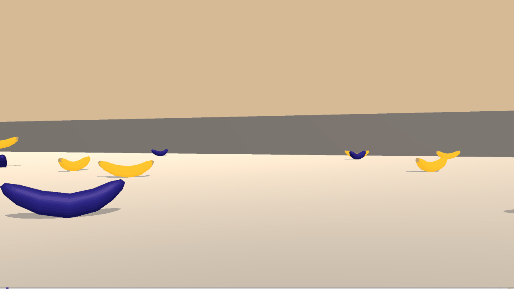
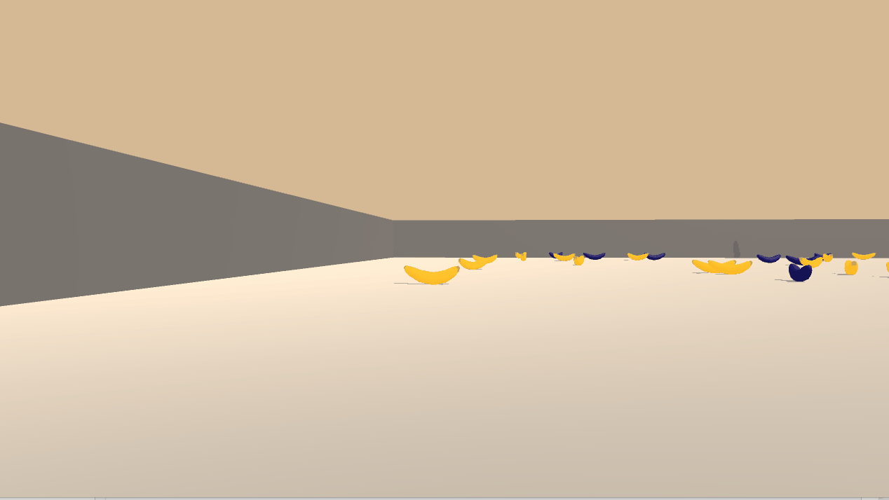
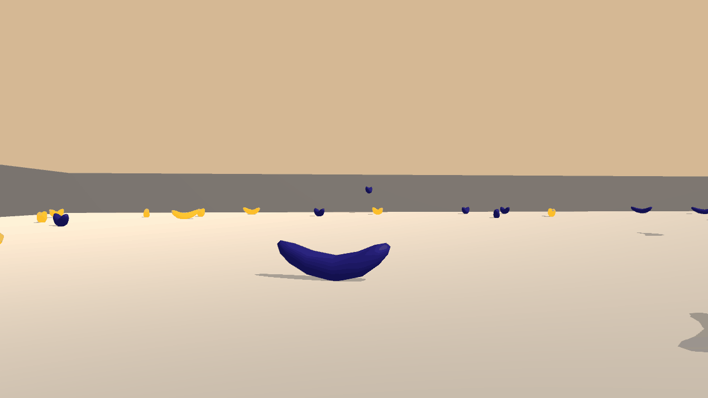

[//]: # (Image References)

[image1]: https://user-images.githubusercontent.com/10624937/42135619-d90f2f28-7d12-11e8-8823-82b970a54d7e.gif "Trained Agent"
[chart_yellow]: assets/chart_yellow.png

# Udacity Deep Reinforcement Learning Nanodegree

# Project 1: Navigation

### Introduction

For this project, an agent is trained to collect bananas in a large, square world.  

![Trained Agent][image1] 


A reward of +1 is provided for collecting a yellow banana, and a reward of -1 is provided for collecting a blue banana.  Thus, the goal of your agent is to collect as many yellow bananas as possible while avoiding blue bananas.  

The state space has 37 dimensions and contains the agent's velocity, along with ray-based perception of objects around agent's forward direction.  Given this information, the agent has to learn how to best select actions.  Four discrete actions are available, corresponding to:
- **`0`** - move forward.
- **`1`** - move backward.
- **`2`** - turn left.
- **`3`** - turn right.

The task is episodic, and in order to solve the environment, the agent must get an average score of +13 over 100 consecutive episodes.

### The Environment

The environment is a square world where a single agent will navigate to collect bananas.

* Number of agents: 1
* Number of actions: 4
* State length: 37
  * Example: `[1., 0., 0., 0., 0.84408134 0., 0., 1., 0., 0.0748472  0., 1., 0., 0., 0.25755    1., 0., 0., 0., 0.74177343 0., 1., 0., 0., 0.25854847 0., 0., 1., 0., 0.09355672, 0., 1., 0., 0., 0.31969345 0., 0.]`

### Getting Started

1. Download the environment from one of the links below.  Select the environment that matches your operating system:
    - Linux: [click here](https://s3-us-west-1.amazonaws.com/udacity-drlnd/P1/Banana/Banana_Linux.zip)
    - Mac OSX: [click here](https://s3-us-west-1.amazonaws.com/udacity-drlnd/P1/Banana/Banana.app.zip)
    - Windows (32-bit): [click here](https://s3-us-west-1.amazonaws.com/udacity-drlnd/P1/Banana/Banana_Windows_x86.zip)
    - Windows (64-bit): [click here](https://s3-us-west-1.amazonaws.com/udacity-drlnd/P1/Banana/Banana_Windows_x86_64.zip)
    
    (_For Windows users_) Check out [this link](https://support.microsoft.com/en-us/help/827218/how-to-determine-whether-a-computer-is-running-a-32-bit-version-or-64) if you need help with determining if your computer is running a 32-bit version or 64-bit version of the Windows operating system.

    (_For AWS_) If you'd like to train the agent on AWS (and have not [enabled a virtual screen](https://github.com/Unity-Technologies/ml-agents/blob/master/docs/Training-on-Amazon-Web-Service.md)), then please use [this link](https://s3-us-west-1.amazonaws.com/udacity-drlnd/P1/Banana/Banana_Linux_NoVis.zip) to obtain the environment.

2. Place the file in the DRLND GitHub repository, in the `p1_navigation/` folder, and unzip (or decompress) the file. 

## Dependencies

To set up your python environment to run the code in this repository, follow the instructions below.

1. Create (and activate) a new environment with Python 3.6.

	- __Linux__ or __Mac__: 
	```bash
	conda create --name drlnd python=3.6
	source activate drlnd
	```
	- __Windows__: 
	```bash
	conda create --name drlnd python=3.6 
	activate drlnd
	```

2. Install all dependencies from `requirements.txt`:

```bash
pip install requirements.txt
```

3. Install Pytorch version 0.4.0 with your correct Cuda version (in my case, I'm using cuda 10.0).

```bash
conda install -n drlnd pytorch=0.4.0 cudatoolkit=10.0 -c pytorch
```

### Instructions

Follow the instructions in `Report.ipynb` to get started with training the agent!

### Result

In episode 600, the agent achieved the expected result :+1: (score >= 13). We kept training the agent until 2000 episodes, and the final mean score was higher than 16 :rocket:.

![Chart result yellow][chart_yellow]

So let's see what happen to the agent:

* We started with a random agent:


* After 2000 episodes he learned to collect yellow bananas:


#### Bonus

What happen if we invert the reward and train the agent again? The agent will learn to collect blue banana?

Yes, as we see below, the agent learned to collect blue bananas :metal:! 

